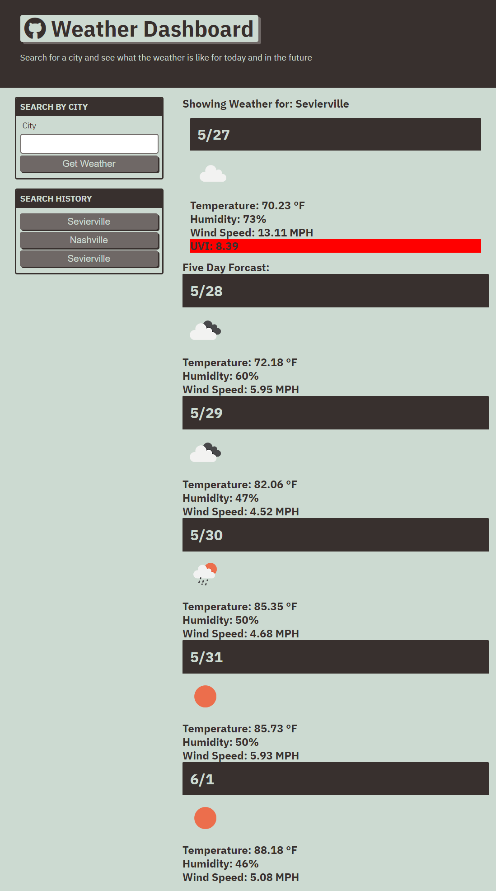

# DESCRIPTION:

A webpage that uses a 3rd party API to display current and future weather events in an area specified by the user. Once the user searches for an area, that area is saved in a search histoy in local storage. 
# SCREENSHOT:

# LINK TO APPLICATION: 

https://seeker-09.github.io/Weather-Dashboard/